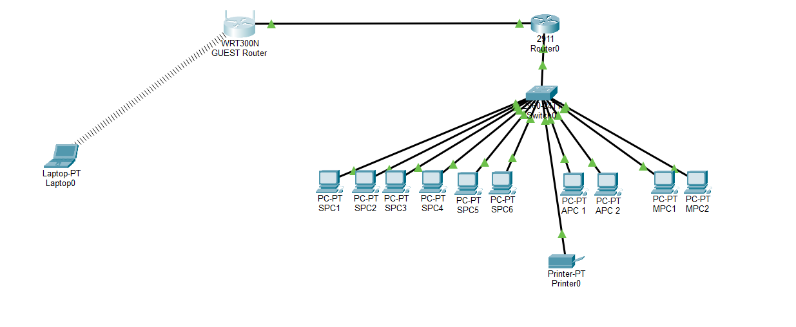

# small-business-network-design
A Cisco Packet Tracer project simulating a small business network with secure guest Wi-Fi.

# Small Business Network Design & Simulation

## Overview
This project demonstrates the design and simulation of a small business network using Cisco Packet Tracer.  
The network supports multiple departments and includes a secure guest Wi-Fi network.

## Network Features
- Router and switch-based network topology
- Static IP addressing scheme
- Verified connectivity using ICMP (ping)
- Separate guest Wi-Fi network with WPA2 security
- Basic network security and segmentation

## Network Topology
The network consists of a central router and switch connecting internal department workstations,
a shared printer, and a separate guest Wi-Fi router.  
The guest network is isolated from the internal LAN to improve security.

## IP Addressing Scheme
- Internal Network: 192.168.10.0 /24
- Guest Network: 192.168.20.0 /24
- Default Gateway: 192.168.10.1

## Tools Used
- Cisco Packet Tracer
- Basic networking concepts

## Author
Krish Chetan Patel  
Computer and Networking Engineering Technology (First Year)

